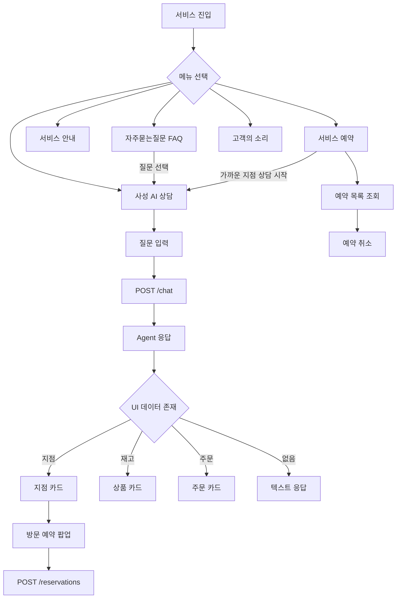

# 02. 화면 흐름도 및 화면정의서

## 1. 전체 화면 구성

서비스는 상단 내비게이션을 기준으로 5개 주요 화면으로 구성된다.

1. 자주묻는질문(FAQ)
2. 사성 AI 상담
3. 서비스 안내
4. 서비스 예약
5. 고객의 소리

사용자는 상단의 사용자 선택 항목에서 데모 사용자를 변경할 수 있다.

## 2. 전체 화면 흐름

---

## 3. 화면별 정의

### 3.1 사성 AI 상담

**목적**  
사용자가 자연어로 질문하고 Agent 답변 및 관련 데이터를 카드 형태로 확인하는 핵심 화면이다.

**주요 구성요소**
- 사용자 선택
- 채팅 메시지 목록
- 질문 입력창
- 빠른 질문 버튼
- 현재 위치/등록 주소 선택 UI
- 지점 카드
- 상품/재고 카드
- 주문 카드
- 방문 예약 팝업

**주요 동작**

| 사용자 행동 | 시스템 동작 |
|---|---|
| 질문 입력 후 전송 | `/chat` API 호출 |
| 가까운 지점 질문 | 필요 시 검색 기준 위치 선택 요청 |
| 지점 결과 확인 | 가까운 지점 카드 표시 |
| 재고 질문 | 상품명·지점·수량 정보 카드 표시 |
| 주문/배송 질문 | 주문 카드 및 배송 정보 표시 |
| 지점 카드에서 예약 | 예약 팝업 표시 후 `/reservations` 호출 |
| 상담 초기화 | `/chat/reset` 호출 |

**입출력 예시**
- 입력: `강남역 로봇청소기 재고 알려주세요`
- 출력: Agent 답변 + 상품/재고 카드

---

### 3.2 자주묻는질문(FAQ)

**목적**  
사용자가 대표 질문을 빠르게 선택하여 AI 상담으로 이동하도록 한다.

**주요 구성요소**
- FAQ 질문 목록
- 질문 선택 버튼

**주요 동작**
- 질문을 선택하면 해당 질문을 `seedPrompt`로 전달하고 사성 AI 상담 화면으로 이동한다.

---

### 3.3 서비스 안내

**목적**  
챗봇이 제공하는 기능 범위와 사용 가능한 상담 유형을 안내한다.

**주요 내용**
- 가까운 지점 조회
- 재고 조회
- 주문·배송 조회
- 배송지 변경
- 교환·환불
- 방문 예약

---

### 3.4 서비스 예약

**목적**  
사용자의 지점 방문 예약을 조회하고 취소한다.

**주요 구성요소**
- 사용자별 예약 목록
- 예약 상태
- 예약 취소 버튼
- 가까운 지점 상담 시작 버튼

**주요 동작**

| 사용자 행동 | 시스템 동작 |
|---|---|
| 화면 진입 | `GET /reservations/{user_id}` |
| 예약 취소 | `POST /reservations/{reservation_id}/cancel` |
| 가까운 지점 상담 | `가까운 매장 알려줘`를 채팅 초기 질문으로 전달 |

---

### 3.5 고객의 소리

**목적**  
사용자의 별도 문의·의견을 DB에 접수한다.

**주요 구성요소**
- 사용자 정보
- 문의 유형
- 문의 내용 입력
- 접수 버튼

**주요 동작**
- 입력값을 `POST /inquiries`로 전송한다.
- 성공 시 생성된 `inquiry_id` 기준으로 접수 완료를 안내한다.

---

## 4. 화면-API 매핑

| 화면 | API |
|---|---|
| 사성 AI 상담 | `POST /chat`, `POST /chat/reset` |
| 지점 방문 예약 | `POST /reservations` |
| 서비스 예약 | `GET /reservations/{user_id}`, `POST /reservations/{reservation_id}/cancel` |
| 고객의 소리 | `POST /inquiries` |
| 처리 결과 알림 | `GET /notifications/{user_id}` |

> 작성 기준: `frontend/src/App.tsx`, `frontend/src/api.ts`, `frontend/src/components/`의 실제 구현을 기준으로 정리하였다.
