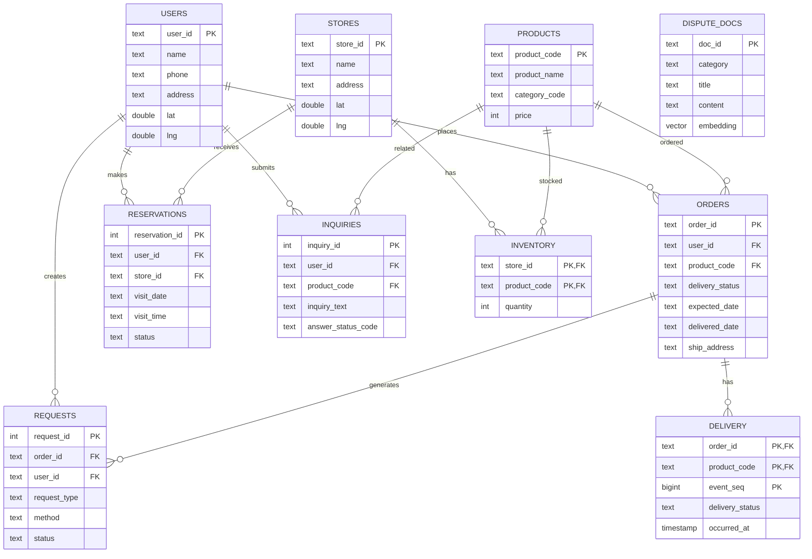

# 04. API 명세 및 데이터 스키마 (ERD)

## 1. API 엔드포인트

| Method | Endpoint | 기능 | 주요 Request | 주요 Response |
|---|---|---|---|---|
| POST | `/chat` | AI 상담 | `user_id`, `message`, 위치 옵션 | 답변, 승인 대기 여부, UI 데이터 |
| POST | `/chat/reset` | 상담 세션 초기화 | `user_id` | 초기화 결과 |
| POST | `/inquiries` | 고객의 소리 등록 | 문의 유형, 문의 내용 | `ok`, `inquiry_id` |
| POST | `/reservations` | 지점 방문 예약 | 사용자, 지점, 날짜, 시간 | 예약 정보 |
| POST | `/reservations/{reservation_id}/cancel` | 방문 예약 취소 | `user_id` | 취소된 예약 정보 |
| GET | `/reservations/{user_id}` | 사용자 예약 조회 | Path `user_id` | 예약 목록 |
| GET | `/admin/requests` | 처리 요청 목록 조회 | 상태 조건 | 요청 목록 |
| POST | `/admin/requests/{request_id}/approve` | 요청 승인 | Request ID | 처리 결과 |
| POST | `/admin/requests/{request_id}/reject` | 요청 거절 | Request ID | 처리 결과 |
| GET | `/notifications/{user_id}` | 사용자 처리 알림 조회 | Path `user_id` | 알림 목록 |

---

## 2. 핵심 API 상세

### 2.1 `POST /chat`

#### Request

```json
{
  "user_id": "U001",
  "message": "강남역 로봇청소기 재고 알려주세요",
  "current_position": null,
  "use_registered_address": false
}
```

| 필드 | 타입 | 필수 | 설명 |
|---|---|---:|---|
| `user_id` | string | N | 기본값 `U001` |
| `message` | string | Y | 사용자 메시지 |
| `current_position` | object/null | N | 브라우저 현재 위치 `{lat, lng}` |
| `use_registered_address` | boolean | N | 등록 주소 사용 여부 |

#### Response

```json
{
  "answer": "답변 문자열",
  "waiting_approval": false,
  "ask_search_origin": false,
  "ui": {
    "stores": [],
    "products": [],
    "orders": []
  }
}
```

| 필드 | 설명 |
|---|---|
| `answer` | 최종 상담 답변 |
| `waiting_approval` | 승인 대기 상태 여부 |
| `ask_search_origin` | 현재 위치/등록 주소 선택 UI 표시 여부 |
| `ui.stores` | 지점 카드 데이터 |
| `ui.products` | 상품·재고 카드 데이터 |
| `ui.orders` | 주문 카드 데이터 |

### 2.2 `POST /reservations`

```json
{
  "user_id": "U001",
  "store_name": "강남역점",
  "visit_date": "2026-10-03",
  "visit_time": "14:00"
}
```

- 날짜 형식: `YYYY-MM-DD`
- 시간 형식: `HH:MM`
- 같은 사용자가 같은 날짜·시간에 `BOOKED` 예약을 중복 생성할 수 없다.

### 2.3 `POST /inquiries`

```json
{
  "user_id": "U001",
  "inquiry_type_code": "ETC",
  "inquiry_text": "문의 내용"
}
```

---

## 3. PostgreSQL 테이블

| 테이블 | 역할 | 주요 Key |
|---|---|---|
| `users` | 사용자 및 등록 주소/좌표 | `user_id` PK |
| `stores` | 지점 및 좌표 | `store_id` PK |
| `products` | 상품 | `product_code` PK |
| `inventory` | 지점별 상품 재고 | `(store_id, product_code)` PK |
| `orders` | 사용자 주문 | `order_id` PK |
| `delivery` | 주문별 배송 상태 이력 | `(order_id, product_code, event_seq)` PK |
| `requests` | 배송지 변경·교환·환불 요청 | `request_id` PK |
| `inquiries` | 고객 문의 | `inquiry_id` PK |
| `reservations` | 지점 방문 예약 | `reservation_id` PK |
| `dispute_docs` | 교환·환불 분쟁해결기준 | `doc_id` PK |

## 4. 주요 컬럼

### `users`

| 컬럼 | 타입 | 설명 |
|---|---|---|
| `user_id` | TEXT | 사용자 ID |
| `name` | TEXT | 사용자명 |
| `phone` | TEXT | 전화번호 |
| `address` | TEXT | 등록 주소 |
| `lat` / `lng` | DOUBLE PRECISION | 등록 주소 좌표 |

### `inventory`

| 컬럼 | 타입 | 설명 |
|---|---|---|
| `store_id` | TEXT | 지점 FK |
| `product_code` | TEXT | 상품 FK |
| `quantity` | INTEGER | 재고 수량 |

### `orders`

| 컬럼 | 타입 | 설명 |
|---|---|---|
| `order_id` | TEXT | 주문 ID |
| `user_id` | TEXT | 사용자 FK |
| `product_code` | TEXT | 상품 FK |
| `order_date` | TEXT | 주문일 |
| `delivery_status` | TEXT | 배송 상태 |
| `expected_date` | TEXT | 예상 배송일 |
| `delivered_date` | TEXT | 배송 완료일 |
| `ship_address` | TEXT | 배송지 |

### `requests`

| 컬럼 | 타입 | 설명 |
|---|---|---|
| `request_id` | INTEGER | 요청 ID |
| `order_id` | TEXT | 주문 FK |
| `user_id` | TEXT | 사용자 FK |
| `request_type` | TEXT | `ADDRESS_CHANGE`, `EXCHANGE`, `REFUND` |
| `method` | TEXT | `STORE_VISIT`, `PICKUP` |
| `new_address` | TEXT | 변경 배송지 |
| `pickup_address` | TEXT | 수거 주소 |
| `reason` | TEXT | 요청 사유 |
| `status` | TEXT | `PENDING`, `APPROVED`, `REJECTED`, `DONE` |

### `dispute_docs`

| 컬럼 | 타입 | 설명 |
|---|---|---|
| `doc_id` | TEXT | 문서 ID |
| `category` | TEXT | 카테고리 |
| `title` | TEXT | 문서 제목 |
| `doc_ids` | TEXT[] | 원본 문서 ID 집합 |
| `content` | TEXT | 문서 내용 |
| `embedding` | `vector(768)` | 임베딩 벡터 |

---

## 5. ERD



## 6. Redis 데이터

| 데이터 | 역할 |
|---|---|
| `stores:geo` | Redis GEO 기반 지점 거리 검색 |
| RedisSaver | LangGraph 체크포인트/상담 State 저장 |
| `thread_id = user_id` | 사용자별 상담 세션 분리 |
| `SESSION_TTL_MINUTES` | 체크포인트 유지 시간, 기본 30분 |

> 작성 기준: `app/api/main.py`, `app/api/schemas.py`, `app/db/schema.sql`, `app/redis_store/`를 기준으로 정리하였다.
