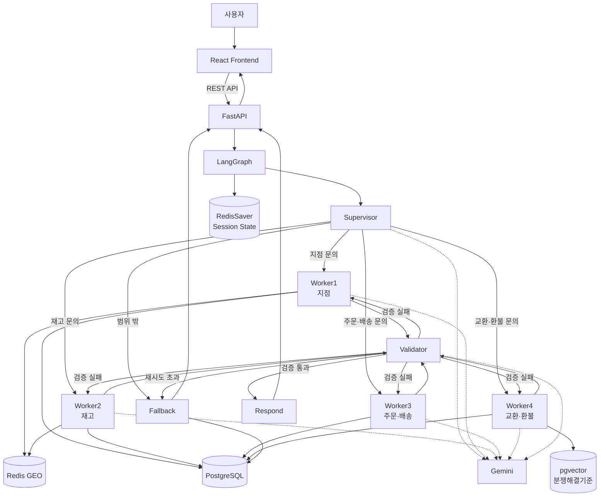
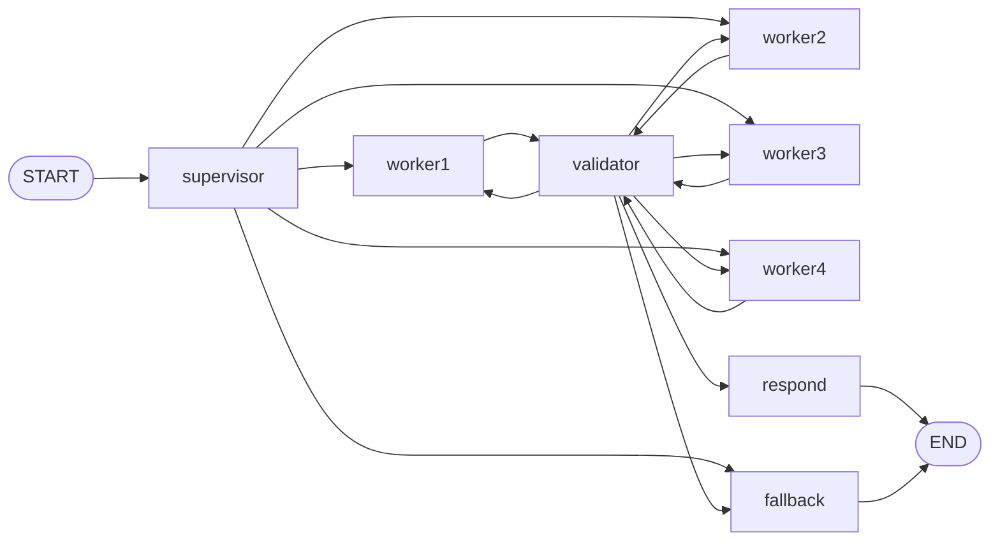

# 05. 아키텍처 다이어그램

## 1. 전체 시스템 아키텍처



## 2. LangGraph 실행 흐름



## 3. 구성요소별 책임

| 구성요소 | 책임 |
|---|---|
| React Frontend | 사용자 입력, 답변 출력, 지점·재고·주문 카드, 예약/FAQ/고객의 소리 UI |
| FastAPI | Frontend와 Agent/DB 기능 사이의 REST API 제공 |
| Supervisor | 문의 유형 분류, 멀티턴 문맥 판단, Worker 라우팅 |
| Worker1 | 가까운 지점 조회 |
| Worker2 | 재고 조회 |
| Worker3 | 주문·배송 조회 및 배송지 변경 |
| Worker4 | 교환·환불 |
| Validator | Tool 결과와 답변 사실 검증 |
| Fallback | 지원 범위 밖 및 검증 실패 최종 처리 |
| PostgreSQL | 업무 데이터 영속 저장 |
| Redis GEO | 거리 기반 지점 검색 |
| RedisSaver | 사용자별 LangGraph State 저장 |
| pgvector | 분쟁해결기준 임베딩 검색 |
| Gemini | 분류, 자연어 생성, 구조화 판단 및 검증 보조 |

## 4. 핵심 데이터 흐름

### 4.1 일반 상담

```text
사용자
→ React
→ POST /chat
→ LangGraph Supervisor
→ 담당 Worker
→ Tool/DB 조회
→ 답변 초안
→ Validator
→ Respond
→ FastAPI
→ React
```

### 4.2 지점/재고

```text
사용자 위치 또는 주소
→ search_origin
→ Redis GEO
→ 지점 후보
→ PostgreSQL 재고 조회
→ UI 카드
```

### 4.3 배송지 변경

```text
주문 조회
→ 변경 주소 확인
→ requests 테이블에 ADDRESS_CHANGE / PENDING 저장
→ 관리자 approve/reject
→ 사용자 알림 조회
```

### 4.4 교환/환불

```text
주문 확인
→ 배송/수령 상태 확인
→ pgvector 분쟁해결기준 검색
→ 교환/환불 방법 확인
→ requests 테이블에 PENDING 저장
```

## 5. 오류 및 안전장치

- 지원 범위 밖 문의 → Fallback
- LLM 답변과 Tool 결과 불일치 → Validator 재작성
- Validator 재시도 초과 → Fallback
- 위치 정보 부족 → 사용자에게 검색 기준 요청
- 중복/유효하지 않은 예약 → API에서 거절
- 배송지 변경·교환·환불은 즉시 확정하지 않고 요청 상태로 저장

> 작성 기준: `app/graph/builder.py`, `app/graph/supervisor.py`, `app/graph/validator.py`, Worker 및 Tool 코드를 기준으로 작성하였다.
