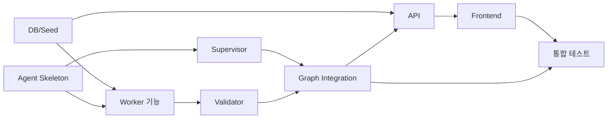

# 06. WBS / 업무분해표 / 담당표 / 일정

> 본 문서는 3일 단기 프로젝트의 최종 구현 결과와 README의 담당 구분을 기준으로 정리한 **역작성 WBS**이다. 실제 최초 계획서가 아니라 최종 산출물용 요약이다.

## 1. 팀 역할

| 팀원 | 주요 담당 |
|---|---|
| 나송주 | Supervisor, LangGraph 통합, RedisSaver, `/chat`, 그래프 테스트, 일부 화면/라우팅 보완 |
| 박서영 | Worker1·2, Redis GEO, 재고 조회, React/예약 관련 기능 |
| 최민정 | Worker3, 주문·배송, 배송지 변경, 관리자 승인·알림 |
| 박종석 | Worker4, 확인 모듈, 교환·환불 |
| 김동규 | Validator, PostgreSQL DB/Seed, Docker, 사용자·문의 Tool, UI 보완 |

## 2. 3일 WBS

| WBS | Day | 작업 | 담당 | 산출물/완료 기준 |
|---|---:|---|---|---|
| 1.1 | 1 | 프로젝트 Skeleton 및 실행환경 구성 | 김동규 중심 / 공통 | FastAPI, LangGraph, DB, Redis 기본 구조 |
| 1.2 | 1 | DB 스키마 및 Mock Seed 구성 | 김동규 | users/stores/products/inventory/orders 등 |
| 1.3 | 1 | Supervisor 기본 분류·라우팅 구현 | 나송주 | Worker1~4/Fallback 라우팅 |
| 1.4 | 1 | Worker1 지점 조회 | 박서영 | 위치 기준 가까운 지점 조회 |
| 1.5 | 1 | Worker2 재고 조회 | 박서영 | 지점·상품 기반 재고 조회 |
| 1.6 | 1 | Worker3 배송 기능 초기 구현 | 최민정 | 주문/배송 조회, 배송지 변경 흐름 |
| 1.7 | 1 | Worker4 교환/환불 초기 구현 | 박종석 | 교환·환불 기본 멀티턴 흐름 |
| 2.1 | 2 | Validator 구현 | 김동규 | Tool 결과 기반 사실 검증 |
| 2.2 | 2 | Supervisor 멀티턴 보완 | 나송주 | 후속 발화/새 문의 구분 |
| 2.3 | 2 | Redis GEO / 검색 기준 공유 | 박서영 | 현재 위치·등록 주소·입력 주소 처리 |
| 2.4 | 2 | 배송지 변경 Request 처리 | 최민정 | PENDING 요청 생성 및 승인 흐름 |
| 2.5 | 2 | 교환·환불 정책 검색 | 박종석 / 김동규 | pgvector 분쟁해결기준 연동 |
| 2.6 | 2 | 채팅 UI 및 카드 연동 | 공통 | 지점·재고·주문 카드 출력 |
| 3.1 | 3 | 방문 예약/취소 기능 | 박서영 중심 | 예약 생성·목록·취소 |
| 3.2 | 3 | FAQ / 서비스 안내 / 고객의 소리 | 나송주·김동규 | 탭 UI 및 API 연결 |
| 3.3 | 3 | 배송/교환/환불 엣지 케이스 수정 | 최민정·박종석·김동규 | 후속 발화 및 중복 요청 보완 |
| 3.4 | 3 | Supervisor 라우팅 보완 | 나송주 | 구매 의사/재고/지점 문의 구분 보완 |
| 3.5 | 3 | 통합 테스트 및 UI 보완 | 공통 | 주요 UC 실행 및 오류 수정 |
| 3.6 | 3 | README 및 최종 산출물 정리 | 공통 | 실행 방법, 구조, 역할 문서화 |

## 3. 작업 의존성

## 4. 완료 체크

- [x] Supervisor → 4개 Worker 라우팅 구조
- [x] Validator 검증 구조
- [x] PostgreSQL 업무 데이터
- [x] Redis GEO 지점 검색
- [x] RedisSaver 세션 저장
- [x] 지점·재고·배송·교환·환불 핵심 기능
- [x] 방문 예약/취소
- [x] FAQ / 서비스 안내 / 고객의 소리
- [x] 관리자 승인/거절 API
- [x] 테스트 코드 작성
- [x] README 정리

## 5. 협업 메모

저장소에서 확인되는 주요 기능 브랜치는 `worker1`, `worker2`, `feature/delivery`, `feature/worker4`, `feature/supervisor-integration`, `feature/reservation`, `feature/frontend-ui` 등이며, 기능 단위로 분리하여 개발한 뒤 `main`으로 병합하는 형태를 사용하였다.
